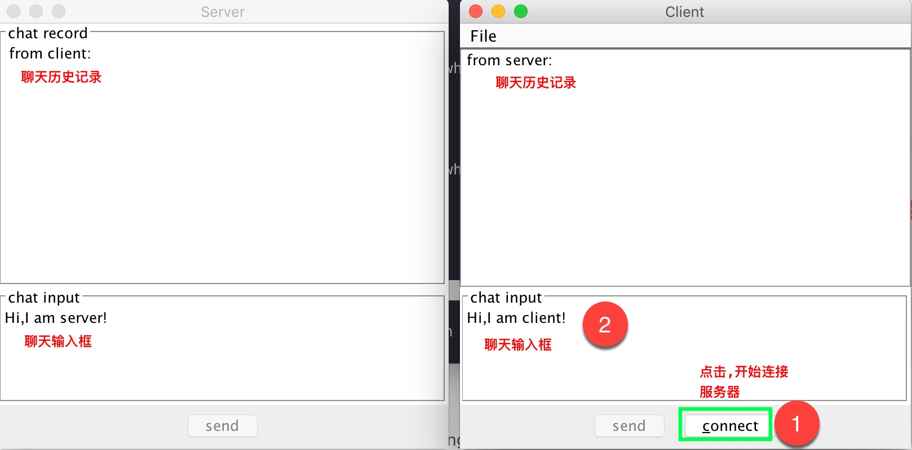
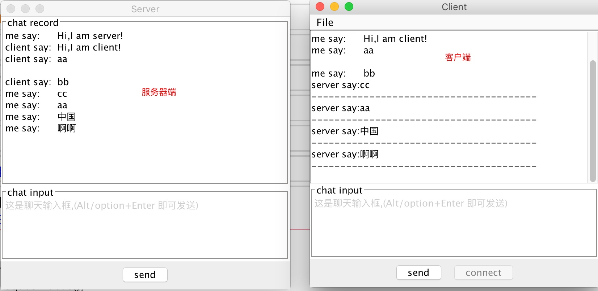
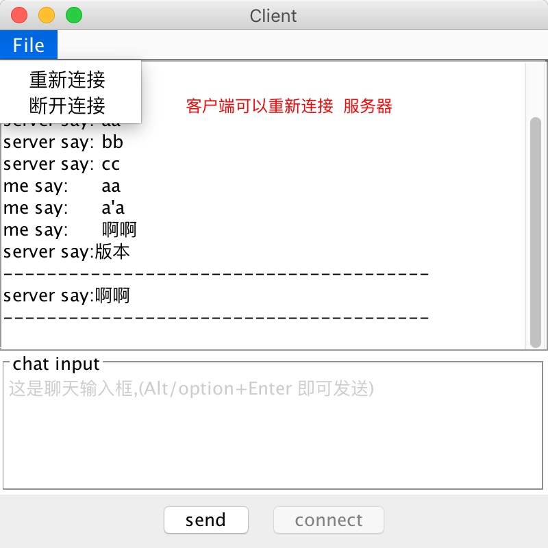

# inetAdress_socket
这是一个使用纯java socket 实现的简易聊天工具.
GUI使用java swing
## 编程语言
Java swing

## 聊天界面

<hr/>


<hr/>


<hr/>


<hr/>



依赖库:
[https://github.com/liuyu520/io0007](https://github.com/liuyu520/io0007)     

## netty版本的简易聊天工具  
依赖:  

```
<!-- https://mvnrepository.com/artifact/io.netty/netty-all -->
        <dependency>
            <groupId>io.netty</groupId>
            <artifactId>netty-all</artifactId>
            <version>4.1.21.Final</version>
        </dependency>
```

地址: [http://i.yhskyc.com/product/1](http://i.yhskyc.com/product/1)